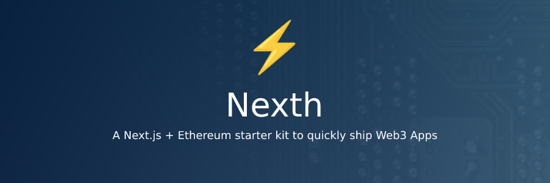

# Nexth

A Next.js + Ethereum starter kit to quickly ship Web3 Apps ⚡



## Packages 📦

- [App](./packages/app) - Next.js 13, with App router
- [Contracts](./packages/contracts/) - Hardhat projects

## Development 🛠️

```bash
npm run dev
# or
yarn dev
```

## Deploy on Vercel 🚢

[](https://vercel.com/new/clone?repository-url=https%3A%2F%2Fgithub.com%2Fwslyvh%2Fnexth)

The easiest way to deploy your Next.js app is to use the [Vercel Platform](https://vercel.com/new?utm_medium=nexth&filter=next.js&utm_source=nexth&utm_campaign=nexth-readme) from the creators of Next.js.

Check out our [Next.js deployment documentation](https://nextjs.org/docs/deployment) for more details.
